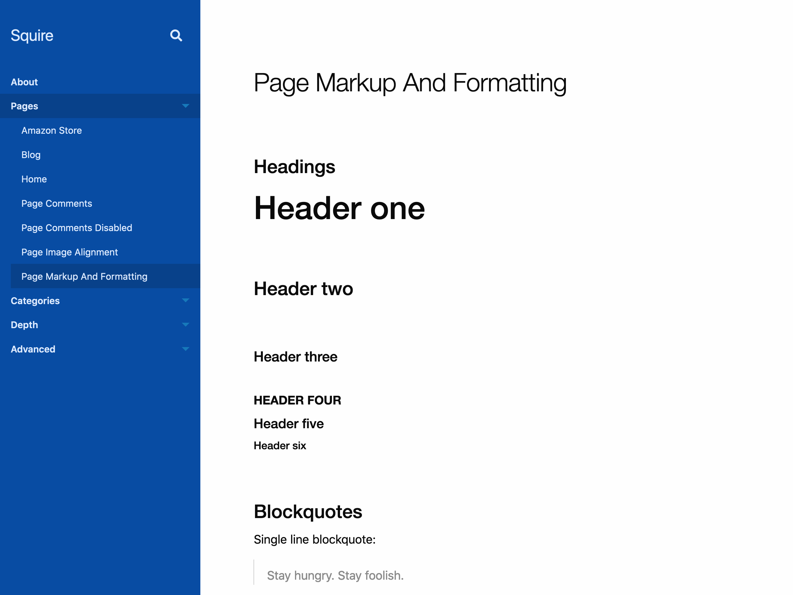

# Squire



## Features

- Build workflow using [gulp.js](https://gulpjs.com/)
- [Foundation for Sites](https://get.foundation/sites/docs/)
- [Font Awesome Pro](https://fontawesome.com/)
- Child pages load within parent with a child page nav for documentation-style pages
- Beaver Builder support
- Force Login option for closing off site during development

## Getting started

```bash
# Installs dependencies and runs the initial build task
yarn
```

## Commands

```bash
# Removes the release dir and builds the project
gulp

# Builds the project
gulp build

# Runs the build task and watches for file changes
gulp watch

# Runs the styles task
gulp styles

# Runs the javascript task
gulp javascript

# Starts Browsersync
gulp server

# Copy theme to release folder for production
gulp release --production
```
